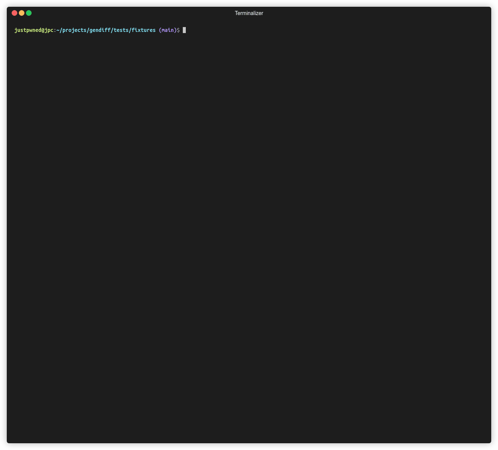

# gendiff

[](https://github.com/justpwned/python-project-lvl2/actions/workflows/ci.yml)
[](https://codeclimate.com/github/justpwned/python-project-lvl2/test_coverage)

Gendiff is a command line tool and library for comparing two documents

Supported formats:

- JSON
- YAML

## Installation

Assuming you've already got [Poetry](https://python-poetry.org/) installed:

```
make package-install
```

## Usage

```bash
usage: gendiff [-h] [-f {stylish,plain,json}] first_file second_file

Compare two documents. Supported formats: JSON, YAML

positional arguments:
  first_file            Old file
  second_file           New file

optional arguments:
  -h, --help            show this help message and exit
  -f {stylish,plain,json}, --format {stylish,plain,json}
                        Set format of output (default: stylish)
```

## Demo



### Diff dict semantics

    <TYPE> := 'dict' | 'list' | 'primitive'
    <VALUE> := <DICT> | <LIST> | <PRIMITIVE>

    {
        field: {
            'state': 'added' | 'removed' | 'unchanged' | 'updated' ,
            'type': <TYPE> | { 'old': <TYPE>, 'new': <TYPE>}
            'value': <VALUE> | { 'old': <VALUE>, 'new': <VALUE> }
        }
    }
